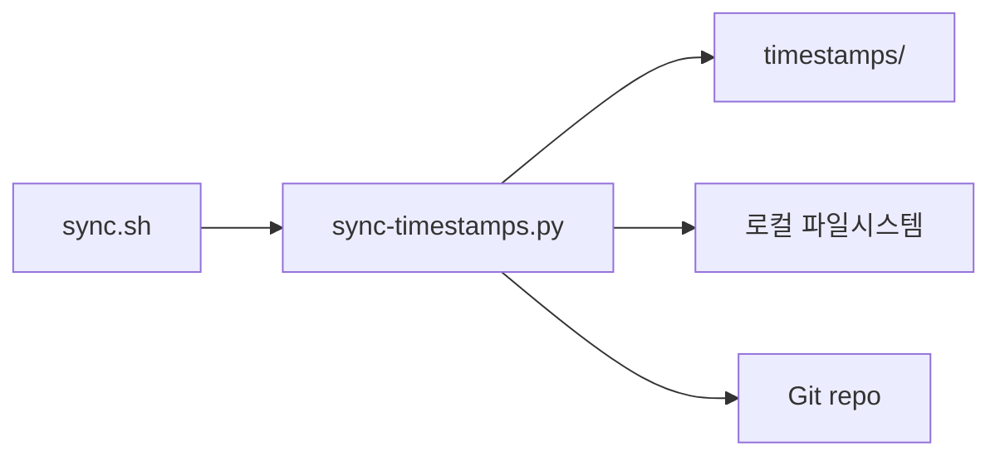

# Sync Engine 설계문서

## 목적

여러 기기(macOS, Ubuntu, Windows) 간 설정 파일을 양방향 동기화한다.
- 성공 기준: 어느 기기에서 설정을 변경하든 30분 이내에 모든 기기에 반영된다.

## 아키텍처



주요 컴포넌트:
- `sync.sh`: 크론으로 30분마다 실행되는 셸 스크립트
- `sync-timestamps.py`: 파일별 타임스탬프 비교 + newest-wins 병합
- `timestamps/`: 호스트별 파일 타임스탬프 JSON 저장

## 데이터 흐름

1. `git fetch origin main` — remote 변경 가져오기
2. `sync-timestamps.py` 실행 — FETCH_HEAD의 피어 타임스탬프와 로컬 mtime 비교
3. 피어가 최신이면 `git show`로 내용 가져와 로컬+repo 동시 갱신
4. `state/{hostname}.md`에 기기 환경 정보 기록
5. `git add` → `git commit` → `git push`

## API 설계

### `should_include(filepath: str, section: str) -> bool`
- 입력: 파일 상대 경로, 섹션명 ("workspace", "claude-code")
- 출력: True (동기화 대상) / False (제외)
- 규칙: EXCLUDES 딕셔너리의 패턴과 CLAUDE_INCLUDES 화이트리스트 기반

### `walk_files(base: Path, section: str) -> dict`
- 입력: 디렉토리 경로, 섹션명
- 출력: `{상대경로: mtime}` 딕셔너리
- `.git` 디렉토리는 항상 제외

### `migrate_ts_keys(ts: dict) -> dict`
- 입력: 타임스탬프 딕셔너리 (구 키 포함 가능)
- 출력: 마이그레이션된 타임스탬프 딕셔너리

## 파일 구조

```
ai-config-sync/
├── sync.sh
├── sync-timestamps.py
├── timestamps/
│   └── {hostname}.json
├── state/
│   └── {hostname}.md
├── openclaw/workspace/
└── claude-code/
```

## 의사결정 근거

- **newest-wins 방식 채택**: 충돌 시 최신 타임스탬프를 가진 파일이 승리. 3-way merge 방식은 설정 파일의 단순한 특성상 과도하여 기각.
- **Windows pull-only**: 회사 보안 정책상 Windows에서 push 불가. 대안으로 별도 sync 서비스를 검토했으나 인프라 비용 대비 효과가 낮아 기각.
