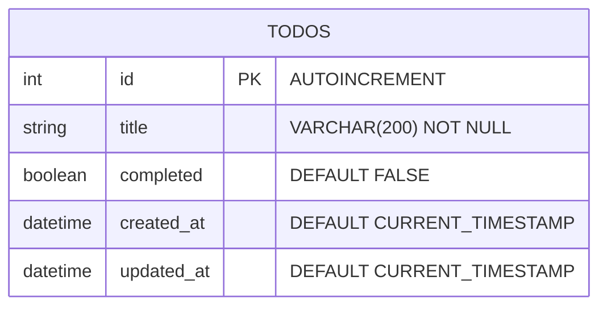

# Architecture Spec: TodoFlow

## 기술 스택

| 영역 | 기술 | 버전 |
|------|------|------|
| Frontend | React + TypeScript + Vite | React 18, Vite 5 |
| Backend | FastAPI (Python) | Python 3.11+ |
| Database | SQLite + aiosqlite | SQLite 3 |
| ORM | SQLAlchemy (async) | 2.0 |
| Styling | CSS Modules | - |
| Test (FE) | Vitest + React Testing Library | - |
| Test (BE) | pytest + httpx | - |
| API Standard | REST (JSON) | - |

## ADR (Architecture Decision Records)

1. SQLite 선택 (PostgreSQL 기각): 단일 사용자 로컬 앱. 설치/운영 비용 최소.
2. SQLAlchemy ORM (Raw SQL 기각): 스키마 관리 용이. 마이그레이션 지원.
3. CSS Modules (Tailwind 기각): 최소 의존성. 컴포넌트 스코프 스타일링.
4. Vite (CRA 기각): 빠른 HMR. React 생태계 표준.
5. TypeScript (JavaScript 기각): 타입 안전성. API 응답 타입으로 프론트-백 계약 명확화.

## DB 스키마

### ERD

### 테이블: todos

| 컬럼 | 타입 | 제약 |
|------|------|------|
| id | INTEGER | PRIMARY KEY AUTOINCREMENT |
| title | VARCHAR(200) | NOT NULL |
| completed | BOOLEAN | NOT NULL DEFAULT FALSE |
| created_at | DATETIME | NOT NULL DEFAULT CURRENT_TIMESTAMP |
| updated_at | DATETIME | NOT NULL DEFAULT CURRENT_TIMESTAMP |

### 인덱스

- `ix_todos_completed` (completed): 완료/미완료 필터링
- `ix_todos_created_at` (created_at): 생성일 정렬

## API 명세

### Endpoints

| Method | Path | Description | Status |
|--------|------|-------------|--------|
| GET | /api/todos | 전체 할일 목록 조회 | 200 |
| POST | /api/todos | 새 할일 생성 | 201 |
| PATCH | /api/todos/{todo_id} | 할일 완료 상태 토글 | 200/404 |
| DELETE | /api/todos/{todo_id} | 할일 삭제 | 204/404 |

### Pydantic Schemas

- `TodoCreate`: title (str, 1-200자)
- `TodoUpdate`: completed (bool)
- `TodoResponse`: id (int), title (str), completed (bool), created_at (datetime), updated_at (datetime)

### CORS

- Origins: http://localhost:5173
- Methods: GET, POST, PATCH, DELETE

## DB-API 정합성

검증 완료. 모든 API 스키마 필드가 DB 컬럼과 1:1 매핑. 타입 불일치 없음.
