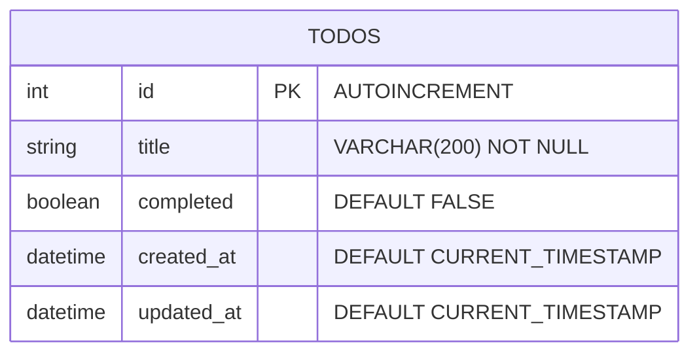

# Design Spec: TodoFlow

이 문서는 idea-brief.md, arch-spec.md, ux-ui-spec.md를 흡수하여 통합한 최종 설계 문서다. Build Phase와 Verify Phase 전체의 기준 문서로 사용한다.

---

## 1. 프로젝트 개요

- **앱명**: TodoFlow
- **요약**: React + FastAPI + SQLite 기반 미니멀 할일 관리 웹앱
- **타겟**: 개발자, 개인 사용자
- **핵심 기능**: 할일 추가, 삭제, 완료 토글 (3가지만)
- **차별점**: React+FastAPI+SQLite 풀스택 MVC 레퍼런스
- **라이선스**: MIT (오픈소스, 비영리)

---

## 2. 기술 스택

| 영역 | 기술 |
|------|------|
| Frontend | React 18 + TypeScript + Vite 5 |
| Backend | FastAPI (Python 3.11+) |
| Database | SQLite 3 + aiosqlite |
| ORM | SQLAlchemy 2.0 (async) |
| Styling | CSS Modules |
| Test (FE) | Vitest + React Testing Library |
| Test (BE) | pytest + httpx (AsyncClient) |
| API | REST (JSON) |
| FE Package | npm |
| BE Package | uv |

### ADR

1. SQLite (PostgreSQL 기각): 단일 사용자, 설치 비용 최소
2. SQLAlchemy (Raw SQL 기각): 스키마 관리, 마이그레이션
3. CSS Modules (Tailwind 기각): 최소 의존성
4. Vite (CRA 기각): 빠른 HMR, 표준
5. TypeScript (JS 기각): 타입 안전성, API 계약

---

## 3. DB 스키마

### ERD



### 테이블: todos

| 컬럼 | 타입 | 제약 |
|------|------|------|
| id | INTEGER | PRIMARY KEY AUTOINCREMENT |
| title | VARCHAR(200) | NOT NULL |
| completed | BOOLEAN | NOT NULL DEFAULT FALSE |
| created_at | DATETIME | NOT NULL DEFAULT CURRENT_TIMESTAMP |
| updated_at | DATETIME | NOT NULL DEFAULT CURRENT_TIMESTAMP |

### 인덱스

- `ix_todos_completed` (completed)
- `ix_todos_created_at` (created_at)

---

## 4. API 명세

### Endpoints

| Method | Path | Description | Request Body | Response |
|--------|------|-------------|-------------|----------|
| GET | /api/todos | 전체 목록 | - | 200: Todo[] |
| POST | /api/todos | 생성 | {title: str} | 201: Todo |
| PATCH | /api/todos/{id} | 완료 토글 | {completed: bool} | 200: Todo / 404 |
| DELETE | /api/todos/{id} | 삭제 | - | 204 / 404 |

### Pydantic Schemas

```python
class TodoCreate(BaseModel):
    title: str  # min_length=1, max_length=200

class TodoUpdate(BaseModel):
    completed: bool

class TodoResponse(BaseModel):
    id: int
    title: str
    completed: bool
    created_at: datetime
    updated_at: datetime
    model_config = ConfigDict(from_attributes=True)
```

### CORS

- Origins: ["http://localhost:5173"]
- Methods: ["GET", "POST", "PATCH", "DELETE"]

---

## 5. UX 설계

### 페르소나

김개발 (28세, 주니어 개발자): 빠른 할일 등록/추적, 단순 UI 선호

### 유저 플로우

1. **할일 추가**: 입력 필드에 제목 -> Enter/버튼 -> 목록에 추가, 입력 초기화
2. **할일 완료**: 체크박스 클릭 -> 취소선 + 색상 변경 -> 재클릭으로 복원
3. **할일 삭제**: 삭제 버튼(x) 클릭 -> 즉시 삭제

### 정보 구조

단일 페이지: 헤더 > 입력 영역 > 할일 목록 > (빈 상태 메시지)

---

## 6. UI 디자인

### 디자인 시스템

| 속성 | 값 |
|------|-----|
| Primary | #4F46E5 |
| Primary Hover | #4338CA |
| Background | #F9FAFB |
| Surface | #FFFFFF |
| Text | #111827 |
| Text Secondary | #6B7280 |
| Completed Text | #9CA3AF |
| Danger | #EF4444 |
| Danger Hover | #DC2626 |
| Border | #E5E7EB |
| Font | Inter, system |
| Border Radius | 8px |
| Shadow | 0 1px 3px rgba(0,0,0,0.1) |

### 화면 레이아웃

```
┌─────────────────────────────────┐
│         TodoFlow (h1)           │
├─────────────────────────────────┤
│ [입력 필드............] [추가]  │
├─────────────────────────────────┤
│ ☐ 장보기                    [×] │
│ ☑ 운동하기 (취소선)         [×] │
│ ☐ 코드 리뷰                [×] │
└─────────────────────────────────┘
```

---

## 7. 실행 계획

### 파일 구조

```
/tmp/auto-dev-test-todo/
├── backend/
│   ├── pyproject.toml
│   ├── main.py
│   ├── database.py
│   ├── models.py
│   ├── schemas.py
│   ├── crud.py
│   └── routers/
│       └── todos.py
└── frontend/
    ├── package.json
    ├── tsconfig.json
    ├── vite.config.ts
    ├── index.html
    └── src/
        ├── main.tsx
        ├── index.css
        ├── App.tsx
        ├── App.module.css
        ├── types/
        │   └── todo.ts
        ├── api/
        │   └── todoApi.ts
        └── components/
            ├── TodoInput.tsx
            ├── TodoInput.module.css
            ├── TodoItem.tsx
            ├── TodoItem.module.css
            ├── TodoList.tsx
            └── TodoList.module.css
```

### 구현 순서

1. Backend 프로젝트 초기화 (pyproject.toml)
2. DB 레이어 (database.py, models.py)
3. Pydantic 스키마 (schemas.py)
4. CRUD 함수 (crud.py)
5. API 라우터 (routers/todos.py)
6. FastAPI 앱 조립 (main.py)
7. Frontend 프로젝트 초기화 (package.json, tsconfig.json, vite.config.ts)
8. 타입 + API 클라이언트 (types/todo.ts, api/todoApi.ts)
9. UI 컴포넌트 (TodoInput, TodoItem, TodoList + CSS)
10. 앱 조립 (App.tsx, main.tsx, 글로벌 스타일)

### CTO 승인

Design Gate PASS (총점 8.80). 아키텍처, DB-API 정합성, UX/UI, 실행 계획 모두 적합.

---

## 8. 실행 방법

### Backend
```bash
cd /tmp/auto-dev-test-todo/backend
uv run uvicorn main:app --reload --port 8000
```

### Frontend
```bash
cd /tmp/auto-dev-test-todo/frontend
npm install
npm run dev
```

### 접속
- Frontend: http://localhost:5173
- Backend API: http://localhost:8000/api/todos
- API Docs: http://localhost:8000/docs
