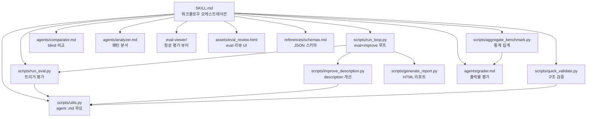

# agent-create 스킬 업그레이드 설계문서

## 목적

agent-create 스킬에 skill-create와 동일한 수준의 eval/benchmark 인프라를 추가하여, 에이전트 생성 후 실제 spawn → 평가 → 개선 루프를 자동화한다.

**성공 기준**: agent-create가 skill-create와 동일한 eval flow (spawn → grade → aggregate → viewer → feedback → iterate + description optimization)를 지원한다.

## 아키텍처

### 현재 구조 vs 목표 구조

```
# 현재 (SKILL.md 1개)
agent-create/
└── SKILL.md

# 목표 (skill-create와 대칭)
agent-create/
├── SKILL.md                          # 워크플로우 대폭 확장
├── scripts/
│   ├── __init__.py
│   ├── utils.py                      # parse_agent_md (agent .md 파싱)
│   ├── quick_validate.py             # agent .md 구조 검증
│   ├── run_eval.py                   # agent description 트리거 평가
│   ├── improve_description.py        # description 자동 개선
│   ├── run_loop.py                   # eval + improve 반복 루프
│   ├── generate_report.py            # description 최적화 HTML 리포트
│   └── aggregate_benchmark.py        # grading 결과 통계 집계
├── agents/
│   ├── grader.md                     # agent 출력물 평가 전문
│   ├── comparator.md                 # blind A/B 비교
│   └── analyzer.md                   # 벤치마크 패턴 분석
├── references/
│   └── schemas.md                    # JSON 스키마 정의
├── assets/
│   └── eval_review.html              # description eval 리뷰 UI
└── eval-viewer/
    ├── generate_review.py            # 정성 평가 뷰어 생성
    └── viewer.html                   # 뷰어 HTML 템플릿
```

### 컴포넌트 간 관계



## 데이터 흐름

### 1. Agent 생성 + Eval 루프

1. **Intent Capture** → 사용자 요구사항 수집 → Intent 블록 생성
2. **Research** → 기존 에이전트 분석 + overlap 체크 → Research Summary
3. **Agent .md 생성** → `~/.claude/agents/{name}.md` 파일 작성 → Self-check 결과
4. **doc-critic 품질 게이트** → 메인 모델이 오케스트레이션 → PASS/REJECT
5. **Test Case 작성** → 2-3개 테스트 프롬프트 + assertions → `evals/evals.json`
6. **Eval 실행** → with_agent(새 에이전트 spawn) + baseline(에이전트 없이) 병렬 실행
7. **Grading** → grader 에이전트가 assertion 평가 → `grading.json`
8. **Aggregate** → `aggregate_benchmark.py`로 통계 집계 → `benchmark.json`
9. **Viewer** → `generate_review.py`로 인간 리뷰 UI 생성 → 브라우저 오픈
10. **Feedback** → 사용자 피드백 수집 → `feedback.json`
11. **Improve** → 피드백 기반 에이전트 수정 → 6번으로 반복

### 2. Description Optimization 루프

1. **Trigger eval 생성** → 20개 should-trigger/should-not-trigger 쿼리 생성
2. **사용자 리뷰** → `eval_review.html`로 쿼리셋 검토/편집
3. **최적화 루프 실행** → `run_loop.py`로 train/test split + 5 iteration 자동 개선
4. **결과 적용** → `best_description`을 에이전트 frontmatter에 반영

## API 설계

### scripts/utils.py

```python
def parse_agent_md(agent_path: Path) -> tuple[str, str, str]:
    """
    에이전트 .md 파일 파싱.

    Args:
        agent_path: 에이전트 .md 파일 경로 (디렉토리가 아닌 파일 자체)

    Returns:
        (name, description, full_content) 튜플

    차이점 vs skill-create의 parse_skill_md:
    - 스킬은 디렉토리 경로 + SKILL.md를 조합
    - 에이전트는 .md 파일 경로를 직접 받음
    - frontmatter에 model, tools, memory 필드 추가 파싱
    """
```

### scripts/quick_validate.py

```python
def validate_agent(agent_path: Path) -> tuple[bool, str]:
    """
    에이전트 .md 파일 구조 검증.

    검증 항목:
    - frontmatter 존재 및 YAML 유효성
    - 필수 필드: name, description
    - name: 영문 kebab-case
    - description: 1024자 이하, 트리거 예시 3-5개 포함
    - model: haiku|sonnet|opus 중 하나 (있는 경우)
    - memory: user (필수)
    - body: Core Principle, Scope, Rules, Workflow, Edge Cases 섹션 존재
    """
```

### scripts/run_eval.py

```python
def run_single_query(query, agent_name, agent_description, timeout, project_root, model) -> bool:
    """
    단일 쿼리에 대해 에이전트가 트리거되는지 테스트.

    차이점 vs skill-create:
    - skill-create: .claude/commands/ 에 임시 command 파일 생성
    - agent-create: .claude/agents/ 에 임시 agent 파일 생성 (또는 기존 파일 활용)
    - 트리거 감지: Agent tool 호출 + subagent_type 매칭
    """
```

### scripts/run_loop.py, improve_description.py, aggregate_benchmark.py, generate_report.py

skill-create의 동일 스크립트를 기반으로, `parse_skill_md` → `parse_agent_md` 호출만 변경. 나머지 로직(train/test split, eval loop, HTML 생성, 통계 집계)은 동일하게 유지.

### agents/grader.md

```
역할: 에이전트 실행 결과물(transcript + outputs)을 expectations 기준으로 평가
차이점 vs skill-create:
- 스킬은 파일 산출물(PDF, XLSX 등) 위주 평가
- 에이전트는 텍스트 응답, 코드 변경, 도구 호출 패턴 위주 평가
- 에이전트 정의의 Workflow 준수 여부 추가 체크
```

### agents/comparator.md, analyzer.md

skill-create 버전과 동일 구조. "skill" 키워드를 "agent"로 치환.

## 파일 구조

```
~/.claude/skills/agent-create/
├── SKILL.md                                    # 수정 (워크플로우 대폭 확장)
├── scripts/
│   ├── __init__.py                             # 신규
│   ├── utils.py                                # 신규 (parse_agent_md)
│   ├── quick_validate.py                       # 신규 (agent 구조 검증)
│   ├── run_eval.py                             # 신규 (skill-create 기반 수정)
│   ├── improve_description.py                  # 신규 (skill-create 기반 수정)
│   ├── run_loop.py                             # 신규 (skill-create 기반 수정)
│   ├── generate_report.py                      # 복사 (변경 없음)
│   └── aggregate_benchmark.py                  # 복사 (변경 없음)
├── agents/
│   ├── grader.md                               # 신규 (에이전트 출력물 평가 특화)
│   ├── comparator.md                           # 복사+수정 (skill→agent)
│   └── analyzer.md                             # 복사+수정 (skill→agent)
├── references/
│   └── schemas.md                              # 신규 (agent eval 전용 스키마)
├── assets/
│   └── eval_review.html                        # 복사 (변경 없음)
└── eval-viewer/
    ├── generate_review.py                      # 복사 (변경 없음)
    └── viewer.html                             # 복사 (변경 없음)
```

## 의사결정 근거

### 채택: skill-create 스크립트 기반 수정 (복사 + 커스터마이징)

스크립트의 핵심 로직(eval 루프, 통계 집계, HTML 리포트, 뷰어)은 skill-create와 동일하되, 에이전트 특화 부분만 수정한다.

**수정이 필요한 파일들** (에이전트/스킬 구조 차이 반영):
- `utils.py`: `parse_agent_md` — 에이전트는 단일 .md 파일, 스킬은 디렉토리
- `quick_validate.py`: `validate_agent` — frontmatter 필드 차이 (model, memory, tools)
- `run_eval.py`: 트리거 감지 — Agent tool 호출 감지 (Skill tool 대신)
- `improve_description.py`: 프롬프트 — "skill" → "agent" 컨텍스트 변경
- `grader.md`: 평가 기준 — 에이전트 출력물(텍스트 응답, 코드 변경) 특화

**변경 없이 복사하는 파일들** (범용 로직):
- `aggregate_benchmark.py`: grading.json 집계는 스킬/에이전트 무관
- `generate_report.py`: HTML 생성은 description optimization 전용
- `eval-viewer/`: 정성 평가 뷰어는 범용
- `assets/eval_review.html`: 트리거 eval 리뷰 UI는 범용

### 기각: 공유 라이브러리로 추출

범용 스크립트를 `~/.claude/shared/scripts/`에 두고 두 스킬이 import하는 방안.

**기각 이유**:
- Claude Code 스킬은 독립 패키지로 배포되는 구조 — 공유 의존성은 배포 복잡성 증가
- 복사본의 유지보수 비용 < 공유 라이브러리의 import 경로 관리 비용
- 현재 skill-create가 이미 self-contained 구조로 잘 동작 중

### 기각: SKILL.md만 수정하고 스크립트 없이 운영

에이전트 테스트를 메인 모델이 직접 inline으로 수행하는 방안.

**기각 이유**:
- Description optimization은 `claude -p` subprocess 호출이 필수 — 스크립트 없이 불가능
- Benchmark aggregation의 통계 계산은 스크립트가 더 정확하고 재현 가능
- 사용자 요구: "동일한 플로우로 맞추고 싶어" — 동일 수준의 인프라 필요

## SKILL.md 변경 계획

현재 SKILL.md의 7단계 워크플로우를 확장하여 skill-create와 동일한 eval 루프를 통합:

### 기존 유지 (Steps 1-5)
1. Capture Intent → 그대로
2. Research Existing Agents → 그대로
3. Generate Agent File → 그대로
4. Self-Check → 그대로
5. Return to Main Model for Quality Gate → 그대로

### 확장/수정
6. **Test Cases 작성** (기존 Step 6 대폭 확장)
   - 2-3개 테스트 프롬프트 작성 → `evals/evals.json` 저장
   - assertions 작성 (에이전트 특화: workflow 준수, output format 일치, scope 준수)

7. **Eval 실행 + 평가** (신규)
   - with_agent + baseline 병렬 spawn
   - grader로 grading → aggregate → viewer → feedback
   - skill-create의 "Running and evaluating test cases" 섹션과 동일 flow

8. **Improving the agent** (신규)
   - feedback 기반 에이전트 수정
   - 반복 루프 (skill-create의 iteration loop와 동일)

9. **Description Optimization** (기존 Step 7 대폭 확장)
   - 20개 eval 쿼리 생성 → 사용자 리뷰 → `run_loop.py` 자동 최적화
   - skill-create의 Description Optimization 섹션과 동일 flow
