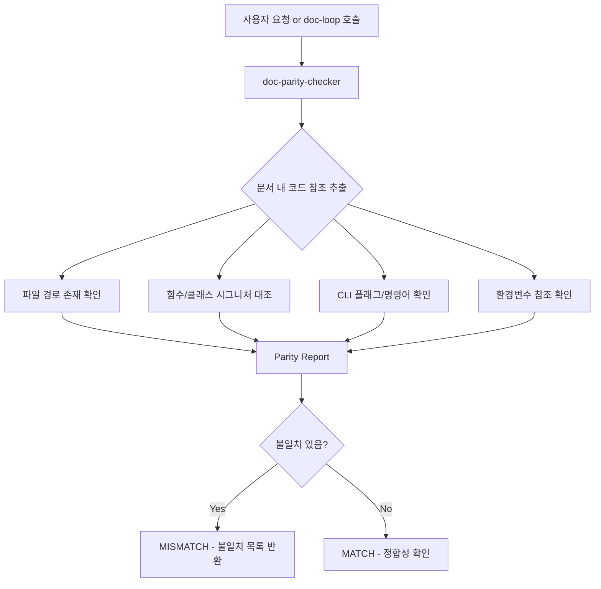

# doc-parity-checker 설계문서

## 목적

문서에 기술된 내용(파일 경로, 함수 시그니처, CLI 플래그, 환경변수 등)이 실제 코드와 일치하는지 검증하는 에이전트를 신설한다.

**성공 기준**: 문서 내 코드 참조 불일치를 90% 이상 탐지하고, 구체적 불일치 항목을 리포트로 출력한다.

## 배경: 현재 문제

| 기존 도구 | 하는 일 | 안 하는 일 |
|-----------|---------|-----------|
| doc-loop | 문서 품질 반복 개선 (writer → critic) | 코드와 일치하는지 검증 |
| doc-critic | 가독성/구조/정확성 채점 | 실제 코드 읽기 |
| doc-updater | git diff 기반 문서 갱신 | **삭제 예정** |
| doc-translator | 문서 번역 | **삭제 예정** |

## 아키텍처



## 데이터 흐름

1. **입력**: 검증 대상 문서 경로 (또는 문서 내용)
2. **참조 추출**: 문서에서 코드 참조를 파싱 — 파일 경로, 인라인 코드의 함수명, CLI 명령어, 환경변수
3. **코드 대조**: Glob/Grep/Read 도구로 실제 코드베이스와 비교
4. **리포트 생성**: 항목별 MATCH/MISMATCH 판정 + 구체적 불일치 내용
5. **출력**: 구조화된 Parity Report를 호출자(메인 모델 또는 doc-loop)에게 반환

## API 설계

### 에이전트 호출 인터페이스

```
Agent(subagent_type="doc-parity-checker")
prompt: "다음 문서의 코드 정합성을 검증하라: {문서 경로 또는 내용}"
```

### 출력 포맷

```
## Parity Report

### Result: MATCH | MISMATCH

### 검증 항목

| # | 유형 | 문서 기술 | 실제 상태 | 판정 |
|---|------|----------|----------|------|
| 1 | 파일 경로 | `src/auth/service.ts` | 존재함 | MATCH |
| 2 | 함수 시그니처 | `login(email, password)` | `login(email, password, rememberMe)` | MISMATCH |
| 3 | 환경변수 | `DB_HOST` (필수) | 코드에서 참조 없음 | MISMATCH |

### 불일치 요약
- 총 검증 항목: N개
- MATCH: N개
- MISMATCH: N개
```

## 파일 구조

```
~/.claude/agents/
├── doc-parity-checker.md   # 신설
├── doc-critic.md           # 유지
├── doc-writer-human.md     # 유지
├── doc-writer-llm.md       # 유지
├── doc-updater.md          # 삭제
└── doc-translator.md       # 삭제

~/.claude/skills/doc-loop/
└── SKILL.md                # 수정 (parity check 단계 추가)
```

### doc-loop 변경 내용

기존: `Writer → 검증 게이트 → Critic → 결과 처리`

변경: `Writer → 검증 게이트 → **Parity Check** → Critic → 결과 처리`

- Writer 출력이 검증 게이트를 통과한 후, Critic 호출 전에 parity-checker를 실행
- MISMATCH 발견 시: 불일치 목록을 Writer에게 전달하여 수정 요청 (Critic을 호출하지 않음)
- MATCH 시: Critic으로 진행

## 의사결정 근거

### 채택: 독립 에이전트 + doc-loop 통합

- 단독 사용 가능 ("이 README 코드랑 맞나 확인해")
- doc-loop에서도 호출 가능 (Writer → Parity → Critic)
- 단일 책임 원칙 준수

### 기각: doc-critic에 Code Parity 채점 기준 추가

- critic의 루브릭 전체 재조정 필요 (가중치 6개로 변경)
- critic에 Bash 도구 추가 필요 → 역할 범위 과도 확장
- critic은 "문서 품질", parity-checker는 "코드 정합성"으로 관심사 분리가 깔끔함

### 기각: doc-updater 유지 + parity-checker 추가

- doc-updater의 핵심 기능(변경 감지 → 문서 갱신)이 parity-checker + writer 조합으로 대체 가능
- 코드맵 기능은 사용하지 않으므로 유지 근거 없음
- 에이전트 수 줄이는 것이 유지보수에 유리
